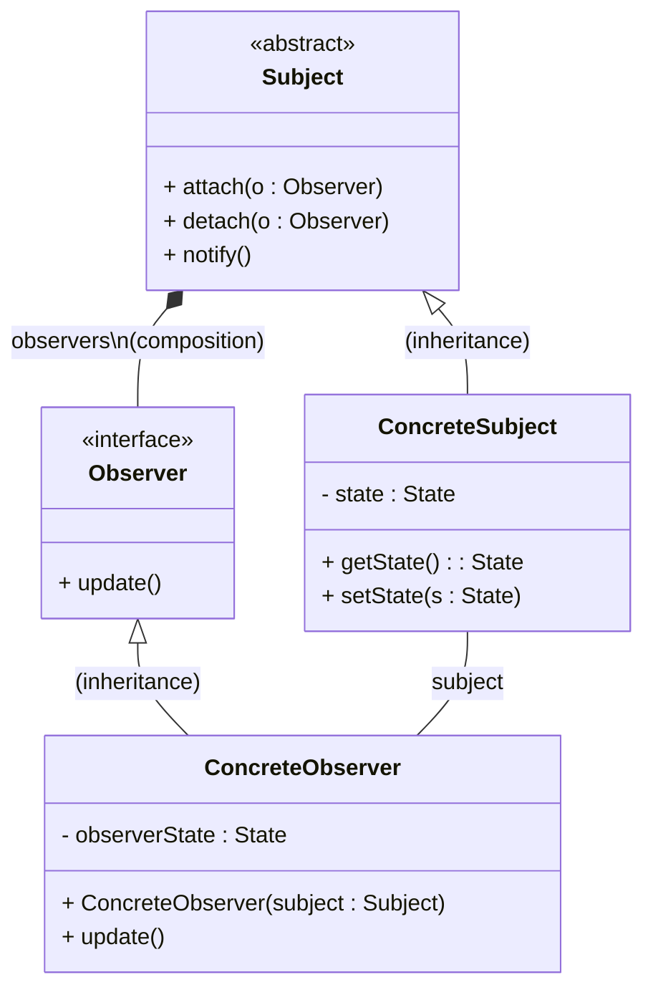

# Observer Design Pattern

```mermaid
classDiagram


class Subject{
    <<abstract>>
    + attach(o : Observer)
    + detach(o : Observer)
    + notify()
}

class ConcreteSubject{
    - state : State
    + getState() : State
    + setState(s : State) 
}

class Observer{
    <<interface>>
    + update()
}

class ConcreteObserver{
    - observerState : State
    + ConcreteObserver(subject : Subject)
    + update()
}


Subject *-- Observer: observers\n(composition)
Subject <|-- ConcreteSubject: (inheritance)
Observer <|-- ConcreteObserver: (inheritance)
ConcreteSubject -- ConcreteObserver: subject

```
